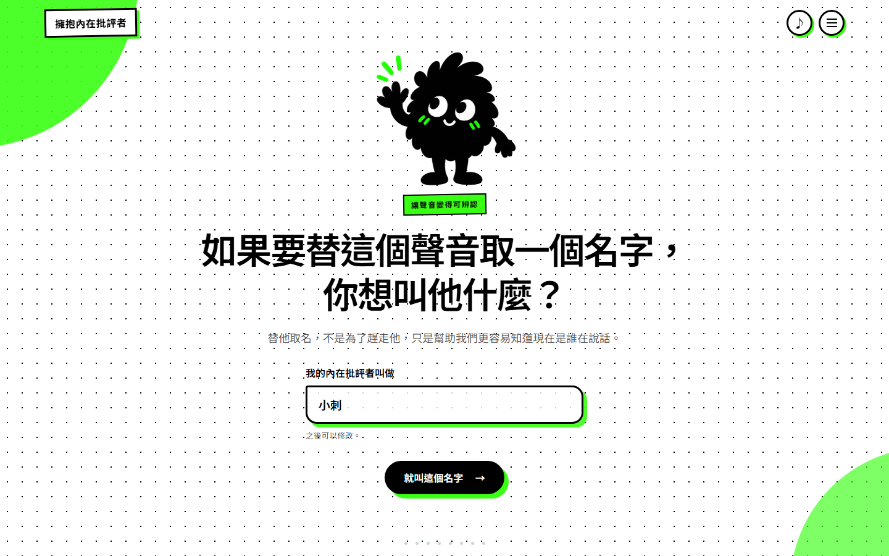
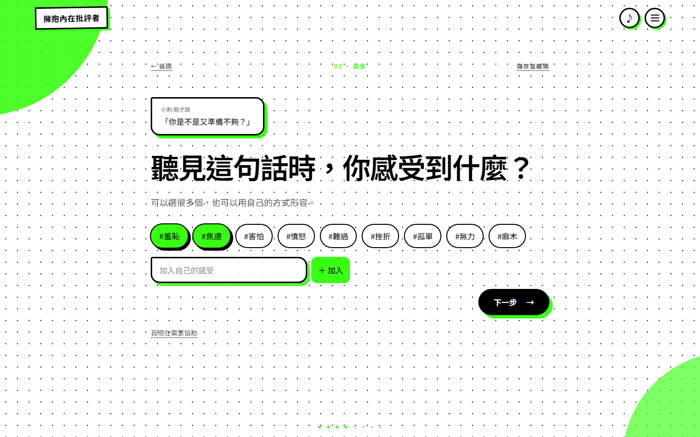
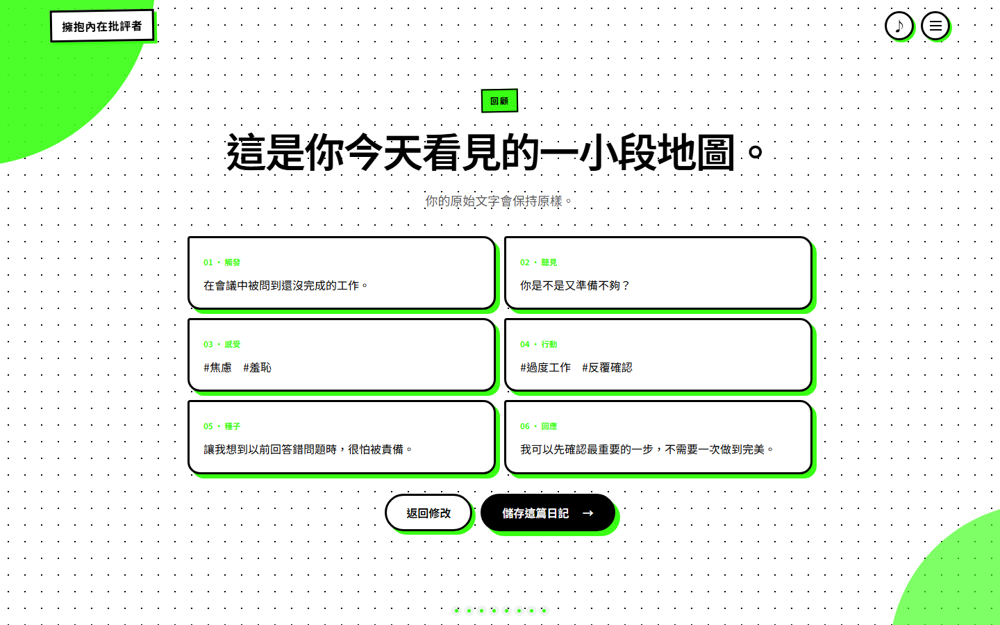
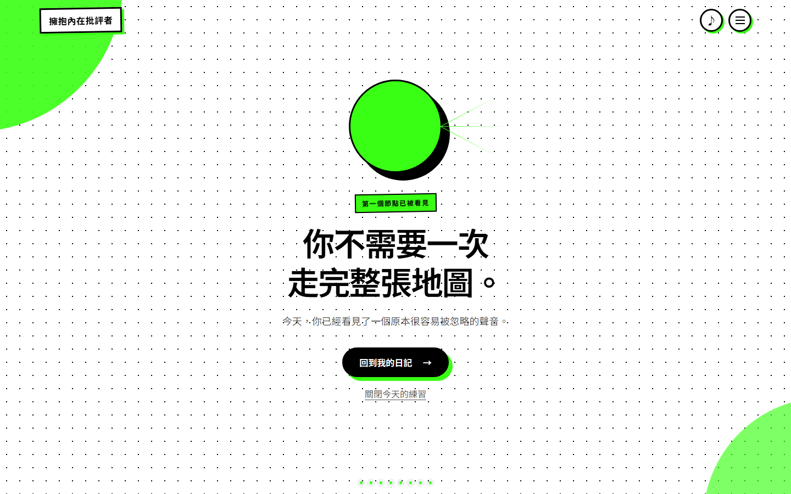

# 擁抱內在批評者

> Embrace Your Inner Critic

一個低干擾、一次一題的引導式自我覺察日記，幫助使用者逐步分開「發生了什麼」、「內在批評者說了什麼」，以及情緒與行為如何受到影響。

- **我的角色：** 產品定義、UX flow、前端互動、後端 API、資料模型、安全設計與技術文件
- **技術：** Nuxt 4、Vue 3、TypeScript、Tailwind CSS 4、ASP.NET Core 10、EF Core 10、PostgreSQL、Supabase、Google OAuth
- **專案狀態：** 開發與測試中

## 問題

一般筆記工具提供很大的自由，但情緒升高時，「自由」也可能變成額外負擔：使用者需要自己決定要寫什麼、如何分類，以及怎麼從混亂的感受中找出可觀察的線索。

這個產品想降低的不是打字成本，而是開始覺察時的認知負擔。它把一篇反省日記拆成小而明確的步驟，讓使用者不必先理解心理學術語，也不需要一次完成所有內容。

## 產品回應

核心體驗只做一件事：引導使用者寫下一篇覺察日記。

使用者先辨認並替內在批評者命名，再依序記錄：

1. 觸發情境
2. 一句最強烈的內在批評
3. 情緒影響
4. 行為影響
5. 可能聯想到的較早經驗
6. 此刻想給自己的回應

每一題都能跳過、回答不確定或暫時停止。完成後，介面點亮一個地圖節點，但不使用排行榜、連續登入或失敗懲罰催促使用者。

> 核心流程動畫仍待錄製；以下畫面皆來自實際前端，並使用固定虛構內容。

## 三個重要產品決策

### 1. 一次只處理一個問題

完整表單雖然能快速呈現所有欄位，卻容易讓正在承受情緒的使用者感到像是在完成作業。逐題流程把注意力留在眼前的一小步，也讓返回、跳過與停止成為正常路徑。

### 2. AI 不代寫使用者的感受

在這個情境中，破碎、矛盾或不確定的文字本身就是重要資料。產品不以生成式 AI 改寫、補完或提供「正確答案」，避免流暢的文字蓋過使用者原本的經驗。

### 3. 安全入口由使用者主動開啟

日記流程提供「我現在需要協助」入口，讓使用者能直接前往安全協助頁。目前沒有宣稱系統能準確辨認危機文字、即時監控或主動報警；自動安全文字攔截仍是未完成項目。

## 核心畫面

### 認識並命名內在批評者

透過插畫與短動畫，把內在批評從「這就是我」暫時移到一個可以被觀察的角色。命名不是為了消滅它，而是增加辨認聲音的空間。

### 一次一題的引導日記

文字題與圓形標籤交替出現，保留「不知道」、「跳過」與中途離開的選擇。背景音樂、按鈕音效及動畫都能關閉。

### 回顧與個人紀錄

登入後，使用者可以儲存草稿或完成紀錄，並讀取、修改及刪除自己的日記。

### 完成一個節點

完成一篇日記後，產品以被點亮的地圖節點回應這次覺察，不顯示分數、排名或連續天數。

## 工程實作

瀏覽器透過 Nuxt 前端與 ASP.NET Core API 互動，後端再透過 EF Core 存取 PostgreSQL。瀏覽器不直接操作資料表。

主要實作包含：

- Google OAuth 與 ASP.NET Core Identity。
- HttpOnly Cookie 驗證及 Cookie 寫入操作的 antiforgery token。
- 依目前登入者 `UserId` 與資源 `id` 查詢私人日記。
- 日記新增、讀取、修改、刪除與分頁。
- request body size、欄位長度、rate limit 與每帳號 500 篇額度。
- Nuxt 與 API 的同源部署設定，減少跨來源 Cookie 複雜度。

## 我學到的事

- MVP 收斂不只是減少頁面，而是保留一條能獨立產生價值的完整使用路徑。
- 敏感產品的 UX 不能只追求完成率；允許停止與不知道，也是有效互動。
- Cookie authentication 的寫入 API 仍需要可驗證的 CSRF 防護；CORS 不能取代 CSRF。
- 私人資料的授權必須在後端查詢層同時綁定資源與登入者，不能依賴前端隱藏按鈕。
- 資料庫 schema、應用程式版本與部署 migration 必須一起驗證，不能只看首頁能否開啟。

## 驗證與目前限制

### 已有實作或專案內測試涵蓋

- 可操作的 Nuxt 前端流程與 production build 設定。
- Google 登入、日記 CRUD 與登入者資料篩選程式碼。
- CSRF、rate limit、request size、分頁及帳號額度限制。
- 後端安全回歸測試，包含第 501 篇日記拒絕與 migration 檢查。

### 仍待完成或重新驗證

- 測試環境的遠端 migration、Google OAuth 與完整 CRUD 端到端流程。
- 使用者無法存取他人日記的完整整合測試。
- 所有日記畫面的 RWD、鍵盤操作與螢幕閱讀器檢查。
- 前端核心流程的自動化測試。
- 帳號刪除、隱私權政策與正式環境營運設定。

## 下一步

優先補上測試環境端到端驗證與所有權整合測試，再完成無障礙／RWD 檢查。這些工作完成後，才將案例頁狀態更新為可公開測試，而不是先擴充更多日記功能。
