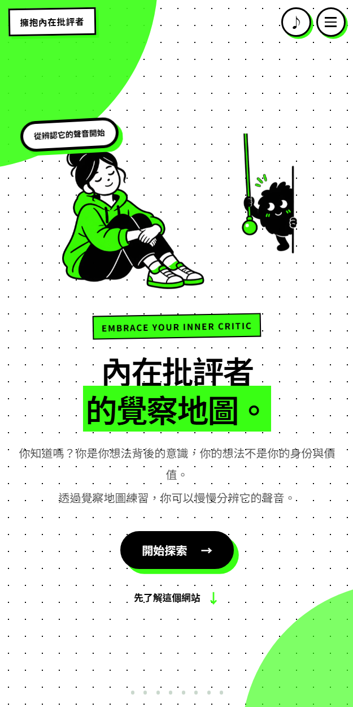
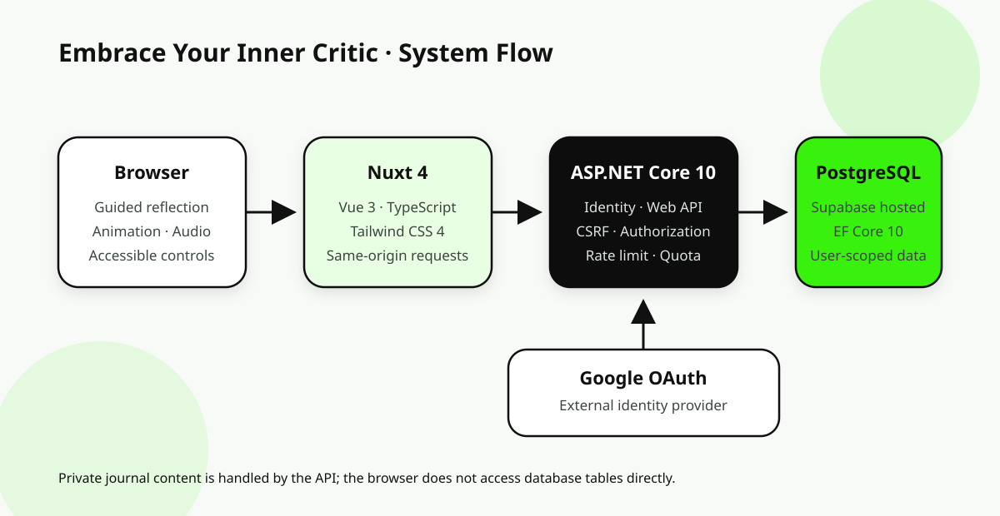

# 擁抱內在批評者｜作品集素材包

這個資料夾集中管理「擁抱內在批評者（Embrace Your Inner Critic）」對外展示需要的文字、圖片規格與技術圖。內容以目前可從程式碼與專案文件確認的功能為準；尚未完成的正式環境驗證不會寫成已上線成果。

## 建議使用方式

| 使用情境 | 建議內容 | 來源 |
| --- | --- | --- |
| 中文履歷 | 專案名稱、1 句定位、3 個 bullet、Tech Stack | [`RESUME_COPY.md`](RESUME_COPY.md) |
| 英文履歷／LinkedIn | English summary、3 個 bullet、Tech Stack | [`RESUME_COPY.md`](RESUME_COPY.md) |
| GitHub README | 主視覺、核心流程 GIF、架構圖、驗證狀態 | [`CASE_STUDY.zh-TW.md`](CASE_STUDY.zh-TW.md) |
| 個人作品集 | 完整案例研究與設計／工程取捨 | [`CASE_STUDY.zh-TW.md`](CASE_STUDY.zh-TW.md) |
| 截圖與錄影 | 拍攝順序、假資料、尺寸、檔名 | [`MEDIA_PLAN.md`](MEDIA_PLAN.md) |

## 建議展示順序

1. **產品定位**：這不是一般空白筆記，而是一次一題的低干擾覺察流程。
2. **核心體驗**：以 12–18 秒 GIF 展示角色命名、日記問題、標籤與地圖節點。
3. **產品判斷**：允許跳過與停止、不要求正向答案、不以 AI 代寫使用者感受。
4. **全端工程**：Nuxt、ASP.NET Core、EF Core、PostgreSQL 與 Google OAuth。
5. **安全設計**：資料所有權、CSRF、rate limit、容量與輸入限制。
6. **誠實狀態**：區分本機／程式碼已驗證與仍待測試環境端到端驗證的項目。

## 建議目錄

完成截圖與錄影後，依照以下檔名放置：

```text
docs/portfolio/
├─ README.md
├─ CASE_STUDY.zh-TW.md
├─ RESUME_COPY.md
├─ MEDIA_PLAN.md
├─ architecture.svg
└─ media/
   ├─ hero-desktop.png
   ├─ core-flow.webp
   ├─ onboarding.png
   ├─ journal-step.png
   ├─ journal-review.png
   ├─ completion.png
   └─ mobile-flow.png
```

目前已完成桌面首圖、手機首圖，以及使用固定假資料拍攝的命名、情緒標籤、日記回顧與完成節點畫面。截圖沒有使用真實登入帳號或私人日記。

## 已完成素材


| 素材 | 狀態 | 說明 |
| --- | --- | --- |
| `hero-desktop.png` | 可使用 | `1440 × 900`，本機實際產品首頁 |
| `mobile-flow.png` | 可使用 | 以裝置縮放模擬窄螢幕的首頁畫面 |
| `core-flow.webp` | 待製作 | 需要走過完整互動並以固定假資料錄製 |
| `onboarding.png` | 可使用 | 實際角色命名畫面，使用名稱「小刺」 |
| `journal-step.png` | 可使用 | 情緒標籤畫面，使用固定假資料 |
| `journal-review.png` | 可使用 | 六步驟回顧，使用固定假資料 |
| `completion.png` | 可使用 | 完成後點亮地圖節點 |



## 技術架構圖



## 發布前檢查

- 截圖不得出現真實姓名、email、OAuth 帳號或私人日記。
- 使用固定假資料，避免不同圖片之間的故事互相矛盾。
- 不宣稱產品能診斷、治療、評估危機或取代心理專業人員。
- 不將「程式碼與部署設定存在」寫成「正式環境已完整驗證」。
- 重新執行專案測試、前端 typecheck／build，並在案例頁更新驗證日期。
- 確認所有圖片、音樂、音效與字體的授權說明仍然正確。
